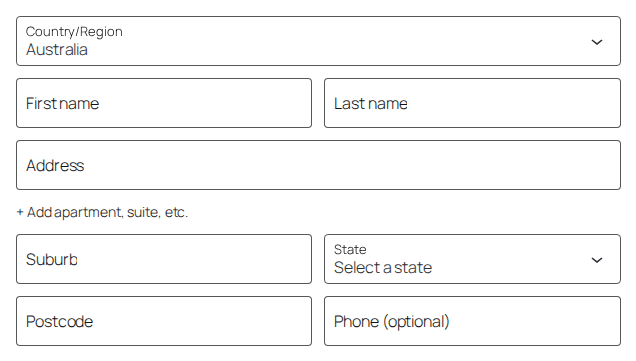
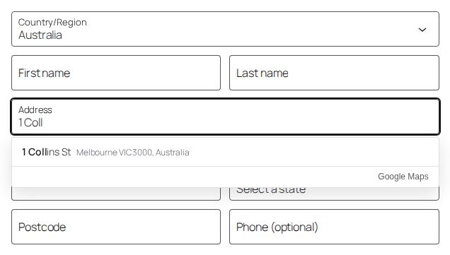
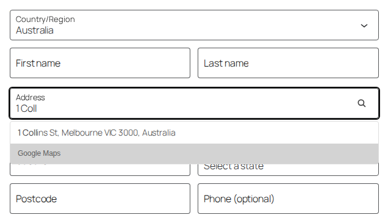
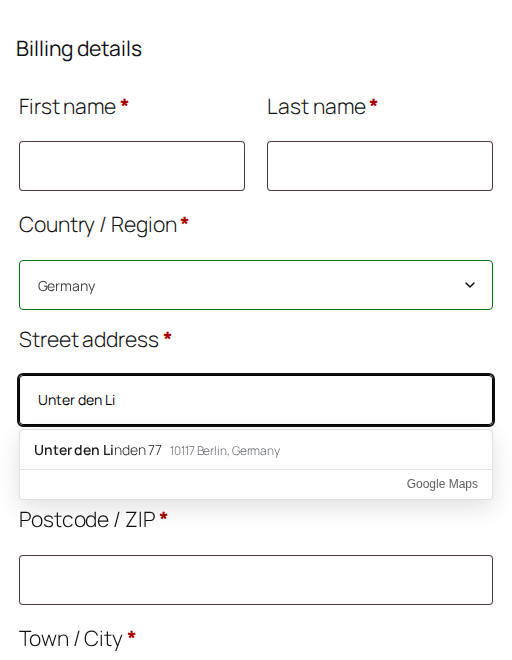
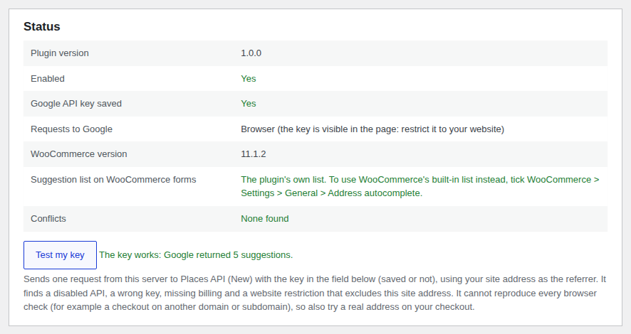

# Address Autocomplete for WooCommerce

Are you tired of finding an address autocomplete plugin that works for your woocommerce shop or using a paid plugin, where this feature should be publicly available? Please try this!

Google address suggestions for the WooCommerce checkout. Customers type a few characters of their address, pick a suggestion, and the street, apartment, city, state, postcode and country are filled into their own fields.

Free, by [HeyU Jewellery](https://github.com/heyu-crystal) and please checkout my shop page if you like: [HeyU Jewellery](https://heyujewellery.com/). **Use it on as many sites as you like, including commercial shops. It may not be sold.** See [Licence](#licence).

[](https://github.com/heyu-crystal/address-autocomplete-for-wp-woocommerce-checkout-page/actions/workflows/ci.yml)



## Features

- Works on the **block checkout**, the **classic (shortcode) checkout**, **My Account › Addresses**, optionally the **classic cart shipping calculator**, and **your own forms** (CSS selectors in the settings).
- Fills each part of the address into its own field, in a way the block checkout (React) keeps: the values are saved with the order.
- Knows local address formats: house number after the street (`Unter den Linden 77`, `Via del Corso, 12`), Japanese block addresses, UK post towns, Italian and Spanish provinces, Brazilian cities, Chinese and Indian districts, and more.
- Maps Google's regions to WooCommerce's state codes, including the awkward ones (New Zealand regions, Irish counties, Italian and Spanish provinces, Japanese prefectures, Chinese provinces, Indian states, Mexican states).
- Never erases an apartment number the customer typed.
- Uses **Places API (New)** with session tokens: one billing session per address picked. The legacy Places API is closed to new Google Cloud projects.
- Also plugs into **WooCommerce's own address autocomplete** (WooCommerce 10.3+) as a Google provider. Only one suggestion list ever opens on a field.
- Accessible: ARIA combobox pattern, keyboard navigation, screen-reader announcements, right-to-left languages.
- Keeps working with performance tools that defer or delay JavaScript.
- Optional **server proxy** that keeps the API key out of the page, **consent** support (WP Consent API), and cost controls.

| Plugin's own list (block checkout) | WooCommerce's built-in list (WooCommerce 10.3+) |
| --- | --- |
|  |  |

| Classic checkout | Status panel and "Test my key" |
| --- | --- |
|  |  |

_Screenshots are from the automated test shop, where Google's answers are simulated._

## Requirements and compatibility

| | Required | Tested |
| --- | --- | --- |
| WordPress | 6.3+ | 7.1.2 |
| WooCommerce | 8.0+ (WooCommerce's built-in list needs 10.3+) | 11.1.2 and 10.9.4 |
| PHP | 7.4+ | 8.3 and 8.1 (end-to-end); syntax and compatibility checked for 7.4 – 8.4 |
| Browsers | Current Chrome, Edge, Firefox, Safari (desktop and mobile) | Chromium (automated) |

- **Checkouts:** WooCommerce block checkout, classic checkout, My Account addresses, classic cart shipping calculator.
- **Third-party checkouts** that keep WooCommerce's field ids (`billing_address_1` …), such as CheckoutWC, FunnelKit and Fluid Checkout, are treated as the classic checkout. They are not part of the automated tests; please report problems. Anything else can be connected with **Custom address fields**.
- **Order storage:** compatible with High-Performance Order Storage (HPOS).

## Installation

1. Download `address-autocomplete-for-woocommerce.zip` from the [latest release](https://github.com/heyu-crystal/address-autocomplete-for-wp-woocommerce-checkout-page/releases/latest). (Not GitHub's "Download ZIP" button: that contains the development files and the wrong folder name.)
2. In WordPress: **Plugins › Add New Plugin › Upload Plugin**, choose the zip, **Install Now**, **Activate**.
3. Set up a Google API key (next section), then go to **WooCommerce › Settings › Integration › Address Autocomplete**, paste the key, and save.
4. Press **Test my key**, then try a real address on your checkout.

## Google Cloud setup

You need a Google Cloud project with billing turned on. Google bills you, not this plugin; see [Cost](#cost).

1. Go to the [Google Cloud console](https://console.cloud.google.com/) and create a project (or pick one).
2. **Billing:** link a billing account to the project. Google requires it even for the free monthly usage.
3. **Enable the API:** APIs & Services › Library › search **"Places API (New)"** › Enable. (Not the legacy "Places API", and the Maps JavaScript API is not needed.)
4. **Create a key:** APIs & Services › Credentials › Create credentials › API key.
5. **Restrict the key** (Credentials › your key):
   - **Application restrictions › Websites**, add both of these lines (with your domain):
     - `https://example.com/*`
     - `*.example.com/*` (for `www.` and other subdomains)

     Write the subdomain line **without** `https://`. Google rejects `https://*.example.com/*`.
   - **API restrictions › Restrict key** › tick **Places API (New)** only.
6. **Budget alert:** Billing › Budgets & alerts › create a budget (for example a few dollars a month) with email alerts. You can also cap the daily requests under APIs & Services › Places API (New) › Quotas.
7. Paste the key in the plugin settings and press **Test my key**.

The key is visible in your page source in the default "Browser" mode. That is normal for browser keys and why the website and API restrictions matter: with them, nobody else can use the key on their own site. If you prefer the key never to appear in the page, use the **Server proxy** mode (below).

## Settings

**WooCommerce › Settings › Integration › Address Autocomplete**

| Setting | What it does |
| --- | --- |
| Enable | Turns the suggestions on or off. |
| Google API key | Your Places API (New) key. |
| Requests to Google | **Browser** (default): the customer's browser asks Google directly. **Server proxy**: the browser asks your site (`/wp-json/aafwc/v1/…`), your site asks Google, the key stays on the server. The proxy checks a nonce, validates every input and rate-limits each visitor (120 requests per 10 minutes by default). It adds one PHP request per search to your server, and full-page caching of checkout pages can serve expired nonces after a day. A key used only by the proxy can be restricted by your server's IP address instead of by website. |
| Suggestion list | **Automatic** (default): WooCommerce's built-in list when it is switched on and working, otherwise the plugin's own. **WooCommerce built-in only** and **Plugin's own list only** force one or the other. See [WooCommerce's built-in list](#woocommerces-built-in-list). |
| Where | Block checkout, classic checkout, My Account addresses, classic cart shipping calculator (city and postcode suggestions in the City field). |
| Custom address fields | Connect any other form, see [Custom forms](#custom-forms). |
| Load scripts on | Every page (default, safest) or only checkout, cart and account pages. Some block themes confuse WooCommerce's page detection; if suggestions disappear, go back to "Every page". The scripts are small and do nothing without an address field. |
| Country | Only suggest addresses in the country the customer has selected (default on). |
| Limit to countries | Two-letter codes, e.g. `AU,NZ`. Customers in other countries get no suggestions and nothing is sent to Google. |
| Language | Language of the suggestions (`en`, `de`, `ja`, `pt-BR` …). Empty = the page's language. |
| Street names | Full (`Miller Street`) or abbreviated (`Miller St`). |
| Apartment / unit | Separate field (default), or for Australia and New Zealand `5/100 Miller St` in the street line. |
| Minimum characters / Typing pause | Cost controls: characters needed before searching (default 3) and the pause after the last keystroke before asking Google (default 220 ms). |
| Wait for consent | With a category chosen, nothing is sent to Google until the visitor consents in a cookie banner that supports the [WP Consent API](https://wordpress.org/plugins/wp-consent-api/). Without that plugin, no suggestions are shown. |
| Colours | Background, text and highlight colours of the list. |

The **Status** panel above the settings shows what is in use and any conflicts (another address autocomplete plugin, WooCommerce's list fed by another provider, missing WP Consent API). **Test my key** sends one request from your server to Google and shows Google's exact answer: API not enabled, key invalid, billing off, or a website restriction that excludes your site. A server can't reproduce every browser check, so also try your checkout.

## WooCommerce's built-in list

WooCommerce 10.3 added its own address autocomplete (**WooCommerce › Settings › General › Address autocomplete**). It needs a "provider" plugin to supply addresses; this plugin registers Google as one.

- **Automatic** mode, WooCommerce's option **ticked**: WooCommerce shows its own list on the block and classic checkouts and fills the fields itself; this plugin supplies the Google results. The plugin's own list still serves My Account (when WooCommerce doesn't), the shipping calculator and custom forms.
- **Automatic** mode, WooCommerce's option **not ticked**: the plugin's own list everywhere.
- Only one list ever opens on a field: wherever WooCommerce's list is active (with any provider), the plugin's list stays closed.

WooCommerce's option is greyed out until a provider plugin is active, and it can keep a stale "on" value after a provider plugin is removed. The status panel tells you what is actually in use.

## Cost

Google bills the owner of the API key. At the time of writing (2025–2026), with Places API (New):

- Each address a customer picks is one **session**: the suggestions requested while typing plus one **Place Details** request for the address parts (`addressComponents`, `formattedAddress`, the "Essentials" level). With a session token, the typing requests in a completed session are not charged separately; you pay for the Place Details request.
- Searches that end without a pick are charged as individual autocomplete requests.
- Google gives a free monthly usage cap per product (10,000 Essentials-level calls per month at the time of writing).

Check Google's current [pricing](https://developers.google.com/maps/billing-and-pricing/pricing) and [session pricing](https://developers.google.com/maps/documentation/places/web-service/session-pricing) pages, and set a budget alert. The plugin keeps costs down with session tokens, a typing pause, a minimum length, a per-page cache of recent searches, stopping after Google refuses a key, and the country limit.

## Privacy and Google's rules

- **What is sent to Google:** the characters typed in the address field, the selected country, the language, a random session token, and the id of the suggestion the customer picks. In "Browser" mode the customer's browser sends these to Google directly, so Google also receives the visitor's IP address and browser details. Names, email addresses, phone numbers and orders are never sent.
- **When:** only while someone types in an address field (at least the minimum number of characters) and when they pick a suggestion. Nothing is sent on page load.
- The plugin adds suggested text to **Settings › Privacy › Policy guide**.
- Use **Wait for consent** if your store asks for consent first.
- Google's "Google Maps" attribution is always shown under the suggestions, as Google requires when Places results are shown without a Google map. Results are not stored: the page keeps recent searches in memory only until it is closed.
- Google's terms: [Google Maps Platform Terms of Service](https://cloud.google.com/maps-platform/terms), [Places API policies](https://developers.google.com/maps/documentation/places/web-service/policies), [Google Privacy Policy](https://policies.google.com/privacy).

## Custom forms

**Custom address fields** connects any form. One `field: CSS selector` per line; only `address_1` (the field people type in) is required. Separate several forms with a blank line. Other fields are looked up inside the same `<form>` first.

```
address_1: #delivery-street
address_2: #delivery-unit
city: #delivery-city
state: #delivery-state
postcode: #delivery-postcode
country: #delivery-country
```

## For developers

**JavaScript hook:** adjust or cancel the parsed address before the fields are filled (both lists).

```js
// Example: New Zealand suburb into address line 2.
document.addEventListener( 'aafwc:address', function ( event ) {
	const { address, place, context } = event.detail; // context.source: 'plugin-list' or 'woocommerce'
	if ( address.country === 'NZ' && ! address.address_2 ) {
		const suburb = ( place.addressComponents || [] ).find( ( c ) =>
			c.types.includes( 'sublocality_level_1' )
		);
		if ( suburb ) {
			address.address_2 = suburb.longText;
		}
	}
	// event.preventDefault(); // cancels filling
} );
```

**PHP filters**

| Filter | Use |
| --- | --- |
| `aafwc_country_rules` | Per-country parsing rules (see `assets/js/address-parser.js`): `numberAfterStreet`, `numberSeparator`, `cityTypes`, `stateTypes`, `streetExtras`, `combineUnit`, `codePrefix`, `stateAliases`. Example: `$rules['NZ'] = array( 'cityTypes' => array( 'sublocality_level_1', 'locality' ) );` |
| `aafwc_frontend_config` | Everything passed to the browser. |
| `aafwc_load_assets` | Load the scripts on the current page or not. |
| `aafwc_place_details` | Google's place details before they go back to the browser (proxy mode). |
| `aafwc_proxy_rate_limit` | `array( 'requests' => 120, 'window' => 600 )` per visitor IP; `0` requests = no limit. |
| `aafwc_proxy_client_ip` | The visitor IP used for the rate limit (e.g. read a trusted proxy header). |

**Styling:** the list uses CSS variables on `.aafwc`: `--aafwc-bg`, `--aafwc-text`, `--aafwc-hover`, `--aafwc-muted`, `--aafwc-line`, `--aafwc-radius`, `--aafwc-shadow`.

**How it works:** see the comments at the top of `assets/js/address-autocomplete.js`. The configuration is printed as `<script type="application/json" id="aafwc-config">` so script optimisers can't run the plugin before its settings exist; field values are written with the native value setter plus real `input`/`change` events, which React and jQuery (selectWoo) both pick up.

## Troubleshooting

Log in as a shop manager and open the browser's Console (F12): the plugin logs what it does for shop managers, and a warning explaining any Google error for everyone.

| Console message / symptom | Fix |
| --- | --- |
| `API_KEY_HTTP_REFERRER_BLOCKED` | The website restriction doesn't include this site. Add `https://example.com/*` and `*.example.com/*`. |
| `SERVICE_DISABLED` or "Places API (New) has not been used" | Enable **Places API (New)** in the project that owns the key. |
| `API_KEY_SERVICE_BLOCKED` | The key's API restrictions don't include Places API (New). |
| `API_KEY_INVALID` | Copy the key again. |
| `BILLING_DISABLED` | Link a billing account to the project. |
| No suggestions, no message | Check the country limit, the "Where" settings, the minimum characters, and the consent setting. Make sure the status panel shows no conflicts. |
| Two suggestion lists | Another address plugin is active, or an old version of this one. The status panel lists known conflicts. |
| Chrome's own address list covers the suggestions | Chrome's autofill wins while it is open; the plugin turns off browser autocomplete on the field once you type. Picking Chrome's address also works. |
| Suggestions stopped after installing a performance plugin | The plugin itself copes with deferred and delayed scripts (tested). But an option that defers **all** scripts can break WooCommerce's block checkout itself (errors such as `wp is not defined`, `moment is not defined`, `reading 'use'`). Exclude the checkout page or WooCommerce/WordPress core scripts from that option, or turn off Cloudflare Rocket Loader for the checkout. |
| Suggestions missing on some pages | Set **Load scripts on** to "Every page". |

## Support

Community-supported, best effort. Please use the [issue tracker](https://github.com/heyu-crystal/address-autocomplete-for-wp-woocommerce-checkout-page/issues) (the bug template asks for the versions and Console output we need). The plugin is re-tested after each major WooCommerce release and when Google announces Places API changes. Report security problems privately, see [SECURITY.md](SECURITY.md).

## Contributing

See [CONTRIBUTING.md](CONTRIBUTING.md) (development setup, tests, coding standards, releases) and the [code of conduct](CODE_OF_CONDUCT.md). Changes are listed in [CHANGELOG.md](CHANGELOG.md).

## Licence

[MIT License with the Commons Clause](LICENSE). In plain words (the [LICENSE](LICENSE) file is the binding text):

- ✅ Use it on any number of websites, including commercial shops and client sites.
- ✅ Change it, and share it (changed or not) **free of charge**, keeping the licence notice.
- ❌ Don't sell it: no charging for the plugin, a copy of it, or a product or service whose value comes entirely or mostly from it (for example selling it, bundling it into a paid plugin, or paid hosting of it).

Note: because of the no-selling condition this is not an OSI "open source" licence and not GPL-compatible. WordPress.org's plugin directory only accepts GPL-compatible plugins, so this plugin is distributed through GitHub.

"Google Maps" and "Places API" are trademarks of Google LLC; "WooCommerce" is a trademark of Automattic Inc. This plugin is not affiliated with or endorsed by Google or Automattic.
